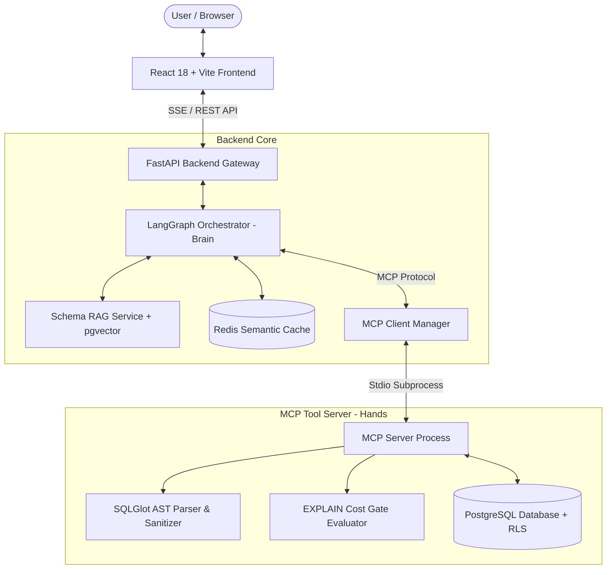

# AI Database Agent 🚀 (Enterprise Text-to-SQL Platform)

An enterprise-grade, multi-tenant **Text-to-SQL Platform** built for modern database interactions. It safely translates natural language prompts into dialect-specific SQL, validates execution through AST parsing and cost guardrails, executes queries against isolated read-only PostgreSQL replicas, and streams real-time reasoning logs, dataset tables, and dynamic visual analytics to a responsive React frontend via Server-Sent Events (SSE).

---

## 📋 Table of Contents

- [💡 About the Project](#-about-the-project)
- [🏗️ System Architecture](#️-system-architecture)
- [✨ Key Features](#-key-features)
- [⚙️ Prerequisites](#️-prerequisites)
- [🗄️ Redis & PostgreSQL Installation](#️-redis--postgresql-installation)
  - [Option A: Docker Setup (Recommended)](#option-a-docker-setup-recommended)
  - [Option B: Manual Local Setup](#option-b-manual-local-setup)
- [🐍 Backend Setup (Python & Pip)](#-backend-setup-python--pip)
- [💻 Frontend Setup](#-frontend-setup)
- [☁️ Render Cloud Deployment](#-render-cloud-deployment)
- [🔑 Environment Variables](#-environment-variables)
- [🔌 API Endpoints & Usage](#-api-endpoints--usage)
- [🛠️ Utility Scripts](#️-utility-scripts)
- [🔒 Security & Guardrails](#-security--guardrails)
- [❓ Troubleshooting](#-troubleshooting)
- [👥 Team & Contributors](#-team--contributors)

---

## 💡 About the Project

Traditional database access often requires writing complex SQL queries or relying heavily on data engineering teams for reporting. **AI Database Agent** bridges this gap by providing an intuitive, secure natural language interface for multi-tenant enterprise databases.

The platform follows a **"Brain vs. Hands" architecture** powered by the **Model Context Protocol (MCP)**:

- **🧠 Orchestration Brain**: Powered by **LangGraph**, it coordinates intent classification, Schema Retrieval-Augmented Generation (Schema RAG), query planning, reflection, and output formatting.
- **🛠️ Execution Hands**: Operating as an isolated **MCP Tool Server**, it safely executes database inspection, AST parsing, EXPLAIN cost estimations, and query execution within multi-tenant Row-Level Security (RLS) contexts.
- **⚡ Real-Time SSE Streaming**: Emits instant updates for agent reasoning steps, tabular data sets, Mermaid ERD graphs, and Chart.js chart configurations directly to the user interface.
- **⚡ Semantic Caching**: Uses **Redis** vector/key-value caching to instantly serve repeated natural language queries without invoking LLM tokens.

---

## 🏗️ System Architecture



---

## ✨ Key Features

- **Natural Language to SQL**: Converts complex business prompts into optimized SQL statements.
- **Multi-Tenant Isolation**: Enforces PostgreSQL Row-Level Security (RLS) dynamically using tenant-scoped context headers.
- **AST Parsing & Validation**: Uses `SQLGlot` to parse queries, detect syntax errors, sanitize inputs, and prevent SQL injection or illegal data mutations.
- **EXPLAIN Cost Guardrails**: Pre-evaluates query execution plans before execution to block heavy table scans or runaway queries.
- **Schema RAG Bootstrap**: Automatically indexes database schemas into vector embeddings (`pgvector`) for precise schema retrieval during query generation.
- **Dynamic Visualizations**: Auto-selects chart types (Bar, Line, Pie, Doughnut) and builds dynamic Chart.js chart configurations on the fly based on query results.
- **Schema & ERD Inspection**: Generates dynamic Mermaid diagram definitions representing database entities and relationships.

---

## ⚙️ Prerequisites

Ensure you have the following installed on your machine:

- **Python**: Version `3.11` or higher
- **Node.js**: Version `18.0` or higher (with `npm` v9+)
- **PostgreSQL**: Version `16+` (with `pgvector` extension enabled)
- **Redis**: Version `7+`
- **Docker & Docker Compose**: (Optional, but recommended for quick setup)
- **Google Gemini API Key**: (Required for LLM generation & embeddings)

---

## 🗄️ Redis & PostgreSQL Installation

You can set up Redis and PostgreSQL using **Docker Compose** (easiest) or via **Manual Local Installation**.

### Option A: Docker Setup (Recommended)

If Docker Desktop or Docker Engine is installed, you can launch PostgreSQL (with `pgvector`) and Redis with a single command from the project root:

```bash
# Start PostgreSQL, Redis, and API containers in detached mode
docker-compose up -d
```

To stop the containers:
```bash
docker-compose down
```

---

### Option B: Manual Local Setup

If you prefer installing services directly on your host operating system:

#### 1. PostgreSQL Setup

##### Installation:
- **Windows**: Download and run the official installer from [postgresql.org](https://www.postgresql.org/download/windows/).
- **macOS**: Install via Homebrew:
  ```bash
  brew install postgresql@16
  brew services start postgresql@16
  ```
- **Ubuntu/Debian**:
  ```bash
  sudo apt update
  sudo apt install postgresql postgresql-contrib
  sudo systemctl start postgresql
  ```

##### Installing `pgvector` Extension:
- Follow instructions at [github.com/pgvector/pgvector](https://github.com/pgvector/pgvector#installation) to compile/install `pgvector` for your OS.

##### Database & User Configuration:
1. Open the PostgreSQL prompt:
   ```bash
   psql -U postgres
   ```
2. Create the database and user:
   ```sql
   CREATE DATABASE enterprise_db;
   CREATE USER postgres WITH PASSWORD 'password';
   GRANT ALL PRIVILEGES ON DATABASE enterprise_db TO postgres;
   \c enterprise_db
   CREATE EXTENSION IF NOT EXISTS vector;
   \q
   ```
3. Initialize tables and seed initial data:
   ```bash
   psql -U postgres -d enterprise_db -f src/db/init_rls.sql
   psql -U postgres -d enterprise_db -f src/db/seed_data.sql
   ```

#### 2. Redis Setup

##### Installation:
- **Windows**: Install via WSL2 (`sudo apt install redis-server`) or download pre-compiled Windows binaries.
- **macOS**:
  ```bash
  brew install redis
  brew services start redis
  ```
- **Linux**:
  ```bash
  sudo apt install redis-server
  sudo systemctl start redis-server
  ```

##### Verify Redis is running:
```bash
redis-cli ping
# Expected response: PONG
```

---

## 🐍 Backend Setup (Python & Pip)

Follow these steps to set up the FastAPI backend using standard **Python** and **pip**.

### 1. Clone the Repository & Navigate to Root
```bash
cd ai-agent-database
```

### 2. Create and Activate a Python Virtual Environment

- **On Windows (PowerShell):**
  ```powershell
  python -m venv venv
  .\venv\Scripts\activate
  ```

- **On macOS / Linux:**
  ```bash
  python3 -m venv venv
  source venv/bin/activate
  ```

### 3. Upgrade Pip & Install Dependencies
```bash
pip install --upgrade pip
pip install -r requirements.txt
```

### 4. Configure Environment Variables
Copy the sample environment file to `.env`:
```bash
# On Windows PowerShell:
Copy-Item .env.example .env

# On macOS / Linux:
cp .env.example .env
```
Edit `.env` and set your credentials (especially `GEMINI_API_KEY`):
```env
APP_NAME="AI Database Assistant"
ENV="development"
PORT=8000

POSTGRES_HOST="localhost"
POSTGRES_PORT=5432
POSTGRES_USER="postgres"
POSTGRES_PASSWORD="password"
POSTGRES_DB="enterprise_db"

REDIS_URL="redis://localhost:6379/0"

GEMINI_API_KEY="your_actual_gemini_api_key_here"
GEMINI_MODEL="gemini-1.5-flash"
GEMINI_EMBEDDING_MODEL="text-embedding-004"
ENABLE_SEMANTIC_CACHE=true
```

### 5. Seed the Database
Populate database tables and create order items:
```bash
python scripts/init_and_seed_db.py
python scripts/seed_order_items.py
```

### 6. Run the FastAPI Development Server
```bash
python main.py
```
*Or using Uvicorn directly:*
```bash
uvicorn app.main:app --reload --app-dir src --host 127.0.0.1 --port 8000
```

Verify backend health at `http://localhost:8000/health` or explore Swagger docs at `http://localhost:8000/docs`.

---

## 💻 Frontend Setup

The frontend is built with **React 18**, **Vite**, **TypeScript**, and **Tailwind CSS**.

### 1. Navigate to Frontend Directory
Open a new terminal window and navigate to `frontend`:
```bash
cd frontend
```

### 2. Install Node Dependencies
```bash
npm install
```

### 3. Start the Development Server
```bash
npm run dev
```

The application will start at `http://localhost:5173/`. Open your browser and navigate to this URL to interact with the system.

### 4. Build for Production (Optional)
```bash
npm run build
```

---

## ☁️ Render Cloud Deployment

The repository includes a ready-to-use [`render.yaml`](file:///c:/Users/chida/OneDrive/Desktop/project/ai-agent-database/render.yaml) Infrastructure Blueprint file for deploying the complete stack to [Render](https://render.com) with one click.

### Quick Blueprint Deployment:
1. Push your repository to **GitHub** or **GitLab**.
2. Go to [Render Dashboard](https://dashboard.render.com/) $\rightarrow$ Click **New +** $\rightarrow$ **Blueprint**.
3. Connect your repository. Render will automatically provision:
   - **PostgreSQL Database** with `pgvector`
   - **Redis Cache**
   - **FastAPI Backend Web Service**
   - **React Static Site Frontend**
4. Provide your **`GEMINI_API_KEY`** when prompted for environment variables.
5. Click **Apply**. Render handles installation, migrations, and service linking automatically!

> For full step-by-step manual deployment instructions, see the detailed [Render Deployment Guide](file:///c:/Users/chida/OneDrive/Desktop/project/ai-agent-database/docs/RENDER_DEPLOYMENT.md).

---

## 🔑 Environment Variables

The backend application reads configuration from `.env`. Below is a reference of available settings:

| Variable | Type | Default Value | Description |
| :--- | :--- | :--- | :--- |
| `APP_NAME` | String | `AI Database Assistant` | Application display name |
| `ENV` | String | `development` | Deployment environment (`development` / `production`) |
| `PORT` | Integer | `8000` | Port for the FastAPI server |
| `POSTGRES_HOST` | String | `localhost` | PostgreSQL hostname |
| `POSTGRES_PORT` | Integer | `5432` | PostgreSQL port |
| `POSTGRES_USER` | String | `postgres` | Database username |
| `POSTGRES_PASSWORD` | String | `postgres` | Database password |
| `POSTGRES_DB` | String | `enterprise_db` | Target PostgreSQL database name |
| `REDIS_URL` | String | `redis://localhost:6379/0` | Connection string for Redis |
| `GEMINI_API_KEY` | String | *(Required)* | Google Gemini API Key |
| `GEMINI_MODEL` | String | `gemini-1.5-flash` | LLM model name for reasoning |
| `GEMINI_EMBEDDING_MODEL` | String | `text-embedding-004` | Model used for vector embeddings |
| `ENABLE_SEMANTIC_CACHE` | Boolean | `true` | Enables/Disables Redis semantic vector cache |
| `APP_API_KEY` | String | `""` | Optional API Key for authentication header (`X-API-Key`) |
| `MAX_PROMPT_LENGTH` | Integer | `2000` | Maximum character length for user input prompts |

---

## 🔌 API Endpoints & Usage

### Primary Endpoints

- **`GET /health`**
  - **Description**: Returns service health status.
  - **Response**: `{"status": "healthy", "service": "AI Database Assistant"}`

- **`POST /api/chat/stream`**
  - **Description**: Server-Sent Events (SSE) streaming endpoint processing user natural language prompts into reasoning steps, SQL queries, tabular data, and visual charts.
  - **Headers**: `Content-Type: application/json`, `X-Tenant-ID: <uuid>` (Optional)
  - **Body**:
    ```json
    {
      "prompt": "Show total sales volume grouped by product category for this month",
      "tenant_id": "00000000-0000-0000-0000-000000000001"
    }
    ```

- **`GET /docs`**
  - **Description**: Interactive OpenAPI Swagger documentation.

### Testing with Postman
A pre-configured Postman collection is included in the project root: [`postman_collection.json`](file:///c:/Users/chida/OneDrive/Desktop/project/ai-agent-database/postman_collection.json). You can import this file directly into Postman to test all REST and SSE endpoints.

---

## 🛠️ Utility Scripts

The `scripts/` directory contains helper scripts for database administration:

- **`scripts/init_and_seed_db.py`**
  - Connects to PostgreSQL, executes SQL initialization scripts, and loads baseline tables and sample records.
  - Usage: `python scripts/init_and_seed_db.py`

- **`scripts/seed_order_items.py`**
  - Populates additional realistic transactional order and order item records into the database for rich analytics queries.
  - Usage: `python scripts/seed_order_items.py`

---

## 🔒 Security & Guardrails

1. **Row-Level Security (RLS)**: Enforces multi-tenant data boundaries directly at the database level by setting tenant session variables (`SET LOCAL app.current_tenant = ...`) prior to query execution.
2. **Read-Only Connections**: Queries are executed using read-only database connections to prevent unintended `DROP`, `UPDATE`, `INSERT`, or `DELETE` operations.
3. **AST Validation**: Every SQL query generated by the LLM is parsed into an Abstract Syntax Tree (AST) using `SQLGlot` to ensure safe operation types.
4. **Execution Cost Gates**: Runs `EXPLAIN` on generated queries before execution to ensure estimated rows and cost metrics remain under safety thresholds.
5. **Rate Limiting & Authentication**: Built-in rate limiting middleware prevents API abuse, and optional API key middleware (`X-API-Key`) secures private instances.

---

## ❓ Troubleshooting

<details>
<summary><b>1. Error: Connection to PostgreSQL failed</b></summary>
Ensure PostgreSQL service is running on `localhost:5432` and credentials in `.env` match your PostgreSQL setup. Check if Docker container `ai_agent_postgres` is running via `docker ps`.
</details>

<details>
<summary><b>2. Error: Connection to Redis failed</b></summary>
Ensure Redis server is running (`redis-cli ping` returns `PONG`). If running locally without Docker, verify `REDIS_URL` in `.env` points to `redis://localhost:6379/0`.
</details>

<details>
<summary><b>3. Error: extension "vector" is not available</b></summary>
Install `pgvector` in your PostgreSQL instance or use the recommended Docker image `pgvector/pgvector:pg16` which has `pgvector` pre-installed.
</details>

<details>
<summary><b>4. Missing GEMINI_API_KEY</b></summary>
Obtain an API key from Google AI Studio and place it into your `.env` file under `GEMINI_API_KEY`.
</details>

---

## 👥 Team & Contributors

This project was built with ❤️ by:

- **Barath G**
- **Rishabh**
- **Saravanan**
