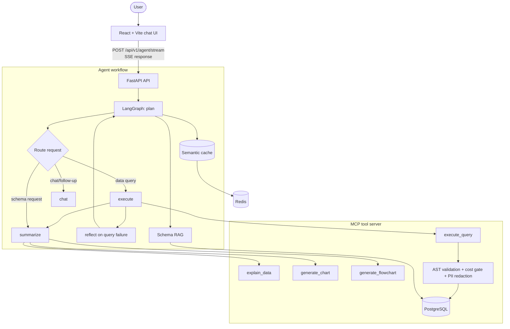

# AI Database Agent

> A ChatGPT-style interface for asking questions about a PostgreSQL database in natural language, inspecting its schema, and receiving tables, charts, Mermaid diagrams, and plain-language explanations.

AI Database Agent is an end-to-end Text-to-SQL application. A React chat interface sends a request to a FastAPI service, where a LangGraph workflow retrieves schema context, asks Gemini to generate a safe PostgreSQL `SELECT`, executes it through an MCP tool server, and streams the result back to the browser over Server-Sent Events (SSE).

The project includes multi-tenant sample data, query validation, query cost checks, PII masking, semantic caching, session memory, charts, and ER diagrams.

## Contents

- [What it does](#what-it-does)
- [Current architecture](#current-architecture)
- [Key features](#key-features)
- [Required tool reference](#required-tool-reference)
- [Supported outputs](#supported-outputs)
- [Repository structure](#repository-structure)
- [Prerequisites](#prerequisites)
- [Quick start](#quick-start)
- [Docker setup](#docker-setup)
- [Configuration](#configuration)
- [Using the application](#using-the-application)
- [API and streaming reference](#api-and-streaming-reference)
- [Sample schema](#sample-schema)
- [Safety model](#safety-model)
- [Current constraints and roadmap](#current-constraints-and-roadmap)
- [Troubleshooting](#troubleshooting)
- [Technology stack](#technology-stack)

## What it does

Ask questions such as:

```text
Show monthly revenue and explain the trend.
Who are the top customers by total spend?
Show order status distribution as a pie chart.
Draw the ER diagram for the database.
What tables are related to orders?
```

For a data question, the application:

1. Retrieves relevant database schema context.
2. Uses Gemini to identify the request and generate PostgreSQL `SELECT` SQL.
3. Validates the query with SQLGlot.
4. Estimates cost with `EXPLAIN (FORMAT JSON)`.
5. Runs the query with a result cap and redacts sensitive fields.
6. Generates an explanation, chart, or Mermaid diagram when the request calls for one.
7. Streams progress, SQL, rows, and final visual specifications to the UI.

## Current architecture



### Current execution model

The present implementation is a controlled workflow agent, not yet a general multi-task DAG agent. Each prompt is classified into one primary route: `query`, `schema`, `chat`, or `contextual`. It can combine a query with an explanation and one chart, but a request with several independent deliverables—such as a trend analysis, ER diagram, and process diagram—cannot be guaranteed to produce all outputs in one turn.

The planned evolution is a task-and-artifact architecture: decompose a request into several tool tasks, execute dependency-ready tasks, record each table/chart/diagram as an artifact, recover individual failures with bounded retries, and verify that every requested artifact was delivered.

## Key features

- Natural language to PostgreSQL `SELECT` queries with Gemini.
- Real-time SSE updates for planning, execution, retries, and final output.
- LangGraph orchestration with a SQL reflection/retry path.
- MCP tool server that separates orchestration from database operations.
- Live schema discovery from `information_schema`.
- Schema retrieval with pgvector/Gemini embeddings when configured.
- Chart.js specifications for bar, line, pie, and scatter charts.
- Mermaid specifications for ER diagrams, process flows, and decision trees.
- SQL transparency: generated SQL is available in the chat UI.
- SQLGlot SELECT-only validation and multi-statement rejection.
- `EXPLAIN` cost threshold, timeout, and row-limit controls.
- PII masking by sensitive column name and common value patterns.
- Redis-backed semantic cache and session event history with in-memory fallbacks.
- Multi-tenant PostgreSQL seed data and RLS policy definitions.
- Session history stored in the browser, with Markdown export.

## Required tool reference

The MCP server exposes the five required tools in [`src/mcp_server/server.py`](src/mcp_server/server.py).

| Tool | Input | Output | Purpose |
|---|---|---|---|
| `get_schema` | None | Tables, columns, primary keys, and foreign keys | Discovers the live PostgreSQL schema for retrieval and ER diagrams. |
| `execute_query` | `sql`, `tenant_id` | Rows, query cost, or an error | Validates, limits, estimates, executes, and redacts a PostgreSQL query. |
| `generate_chart` | Rows, chart type | Chart.js configuration | Builds `bar`, `line`, `pie`, or `scatter` chart specs. |
| `generate_flowchart` | Diagram type, schema or rows | Mermaid definition | Produces `er`, `process`, or `decision` diagrams. |
| `explain_data` | Prompt, rows | Summary and metrics | Explains query data in plain language using Gemini, with a deterministic fallback message. |

## Supported outputs

| Output | Backend support | UI support | Notes |
|---|---|---|---|
| Tables | Yes | Yes | Results are displayed in a data grid. |
| Bar chart | Yes | Yes | Supported end to end. |
| Line chart | Yes | Yes | Supported end to end. |
| Pie chart | Yes | Yes | Supported end to end. |
| Scatter chart | Yes | Not currently rendered | The MCP tool can generate it, but the current React renderer does not include a scatter branch. |
| ER diagram | Yes | Yes | Generated from schema foreign-key metadata and rendered with Mermaid. |
| Process flow | Yes | Partially routed | The tool supports it, but current planner routing prioritizes ER-style schema output. |
| Decision tree | Yes | Partially routed | The tool supports it; dedicated request planning is still needed. |

## Repository structure

```text
ai-agent-database/
├── frontend/                         # React + Vite + Tailwind client
│   └── src/
│       ├── components/               # Chat, charts, diagrams, schema explorer
│       ├── hooks/useAgentStream.ts   # SSE client and local chat sessions
│       └── App.tsx
├── src/
│   ├── agent/
│   │   ├── graph.py                  # LangGraph workflow and routing
│   │   ├── mcp_client.py             # Long-lived stdio MCP client
│   │   ├── sse.py                    # LangGraph-to-SSE conversion
│   │   └── nodes/                    # plan, execute, reflect, summarize, chat
│   ├── app/
│   │   ├── main.py                   # FastAPI lifespan, middleware, static mounting
│   │   └── api/v1/                   # Agent stream, health, cache, sessions endpoints
│   ├── core/                         # AST validation, cost evaluation, PII redaction
│   ├── db/                           # Pool, migrations, RLS script, seed data
│   ├── mcp_server/server.py          # Five MCP tools
│   └── services/                     # Schema RAG, cache, and session memory
├── scripts/                          # Database initialization helpers
├── docs/                             # Architecture and deployment documentation
├── docker-compose.yml                # PostgreSQL, Redis, API services
├── Dockerfile                        # FastAPI container image
├── requirements.txt
└── README.md
```

## Prerequisites

- Python 3.11 or later.
- Node.js 18 or later.
- PostgreSQL 16+ with the `vector` extension for semantic schema retrieval. The project can still start when pgvector/Gemini embeddings are unavailable, but retrieval quality is reduced.
- Redis 7+ for semantic caching and session memory. The application has fallbacks when Redis is unavailable.
- A Google Gemini API key for natural-language planning and data explanations.
- Docker Desktop and Docker Compose are recommended for PostgreSQL and Redis.

## Quick start

### 1. Configure environment variables

Create a local environment file from the example:

```powershell
Copy-Item .env.example .env
```

Set a valid Gemini key and model values in `.env`:

```env
GEMINI_API_KEY="your-key"
GEMINI_MODEL="gemini-3.1-flash-lite"
GEMINI_EMBEDDING_MODEL="gemini-embedding-001"
```

### 2. Start PostgreSQL and Redis

```powershell
docker compose up -d postgres redis
```

The first initialization creates the schema and seed data automatically through `src/db/init_rls.sql` and `src/db/seed_data.sql`.

### 3. Run the API

```powershell
python -m venv venv
.\venv\Scripts\Activate.ps1
pip install -r requirements.txt
uvicorn app.main:app --host 0.0.0.0 --port 8000 --app-dir src --reload
```

The API is available at:

- Health: `http://localhost:8000/health`
- API health: `http://localhost:8000/api/v1/health`
- OpenAPI: `http://localhost:8000/docs`

### 4. Run the frontend

In a second terminal:

```powershell
Set-ExecutionPolicy -Scope Process -ExecutionPolicy Bypass
Set-Location frontend
npm install
npm run dev
```

Open `http://localhost:5173`.

The Vite development server proxies `/api` requests to `http://localhost:8000`. To target another API address, set `VITE_API_BASE_URL` in `frontend/.env`.

## Docker setup

Start the supplied services:

```powershell
docker compose up --build
```

This starts PostgreSQL, Redis, and the FastAPI service on port `8000`.

> Current deployment note: the Dockerfile builds the API service only. It does not build and copy `frontend/dist`, so the production container does not currently include the React user interface. Run the Vite frontend separately or add a frontend build stage before treating this as a single-container application deployment.

To stop the stack:

```powershell
docker compose down
```

To reset local database volumes and recreate seeded data:

```powershell
docker compose down -v
docker compose up --build
```

This removes local Docker database and Redis volumes.

## Configuration

| Variable | Required | Default | Description |
|---|---:|---|---|
| `APP_NAME` | No | `AI Database Assistant` | Service name. |
| `ENV` | No | `development` | Runtime environment label. |
| `PORT` | No | `8000` | API port. |
| `DATABASE_URL` | No | — | PostgreSQL DSN; overrides separate PostgreSQL fields. |
| `POSTGRES_HOST` | No | `localhost` | PostgreSQL hostname. |
| `POSTGRES_PORT` | No | `5432` | PostgreSQL port. |
| `POSTGRES_USER` | No | `postgres` | PostgreSQL user. |
| `POSTGRES_PASSWORD` | No | `postgres` | PostgreSQL password. |
| `POSTGRES_DB` | No | `enterprise_db` | PostgreSQL database name. |
| `REDIS_URL` | No | `redis://localhost:6379/0` | Redis connection URL. |
| `GEMINI_API_KEY` | Yes for AI planning | — | Gemini API key. |
| `GEMINI_MODEL` | Yes for AI planning | — | Gemini generation model. |
| `GEMINI_EMBEDDING_MODEL` | Recommended | — | Gemini embedding model for Schema RAG. |
| `ENABLE_SEMANTIC_CACHE` | No | `true` | Enables semantic cache reads/writes. |
| `APP_API_KEY` | No | empty | Optional API key required in `X-API-Key` for non-public API endpoints. |
| `MAX_PROMPT_LENGTH` | No | `2000` | Maximum input prompt length. |

## Using the application

### Query data

```text
Show total sales by order status.
Show monthly revenue as a line chart.
Who are the top customers by total spent?
```

The agent retrieves schema context, creates a PostgreSQL `SELECT`, validates it, executes it, and returns rows. If the request suggests a visualization, it also asks the chart tool for a Chart.js specification.

### Explore the schema

```text
Draw the ER diagram.
What are the relationships between orders and customers?
Explain the products table.
```

Schema requests use live metadata from `information_schema` and return a Mermaid ER diagram when requested.

### Continue a conversation

```text
Explain that in simpler terms.
Tell me more.
```

Follow-up prompts use backend session memory when a session ID is supplied. The UI currently persists browser sessions locally; see [Current constraints and roadmap](#current-constraints-and-roadmap) for the session-boundary limitation.

## API and streaming reference

Base URL: `http://localhost:8000`

### `POST /api/v1/agent/stream`

Runs an agent turn and returns `text/event-stream`.

Request body:

```json
{
  "prompt": "Show monthly revenue as a line chart",
  "tenant_id": "a0eebc99-9c0b-4ef8-bb6d-6bb9bd380a11",
  "user_id": "console-operator",
  "session_id": "optional-session-id"
}
```

SSE events:

| Event | Meaning | Important fields |
|---|---|---|
| `status` | Current workflow phase | `phase`, `message` |
| `plan_ready` | Planning completed | `strategy`, `sql` |
| `execution_complete` | Database query completed | `rows`, `data`, `cost` |
| `reflection_retry` | SQL retry initiated | `error`, `retry` |
| `final_response` | Final agent result | `summary`, `chart_spec`, `diagram_spec`, `tool_calls` |
| `error` | Stream-level failure | `message` |
| `complete` | Stream has ended | `ok` |

### Other endpoints

| Method | Endpoint | Purpose |
|---|---|---|
| `GET` | `/health` | Top-level API health check. |
| `GET` | `/api/v1/health` | Versioned API health check. |
| `POST` | `/api/v1/cache/clear` | Clears semantic query cache. |
| `GET` | `/api/v1/sessions` | Returns session-storage information. |
| `GET` | `/api/v1/sessions/{session_id}/history` | Returns recorded session events. |

## Sample schema

The supplied seed data represents a multi-tenant commerce database.

```text
customers ──< orders ──< order_items >── products
```

| Table | Description |
|---|---|
| `tenants` | Tenant catalog. |
| `customers` | Customer identity and contact information. |
| `orders` | Customer orders with status and total amount. |
| `products` | Product catalog, category, and price. |
| `order_items` | Line items connecting orders and products. |
| `schema_catalog` | Schema metadata and vector embeddings used by Schema RAG. |

The seed data contains two tenants:

- Acme Corporation: `a0eebc99-9c0b-4ef8-bb6d-6bb9bd380a11`
- Globex Industries: `b1eebc99-9c0b-4ef8-bb6d-6bb9bd380a22`

## Safety model

The project has several safeguards around LLM-generated SQL:

| Control | Implementation |
|---|---|
| Read-only query validation | SQLGlot rejects non-`SELECT` and multi-statement input. |
| Result limit | Missing limits are added; limits above 100 are reduced. |
| Query budget | `EXPLAIN (FORMAT JSON)` is evaluated before execution. |
| Timeout | Query and explain calls use a 15-second timeout. |
| PII masking | Sensitive field names and common data patterns are replaced with `***`. |
| Tenant context | The executor sets `app.current_tenant_id` for RLS policies. |
| API access control | An optional `APP_API_KEY` middleware protects API routes. |
| Rate limiting | A simple in-process, per-IP rate limit protects API routes. |

### Production security warning

The current Docker setup connects as `postgres`, while PostgreSQL owners/superusers can bypass RLS. The database script creates an `agent_read_only_runner` role, but `execute_query` does not yet switch to that role. In production, use an authenticated user identity, resolve tenant access server-side, and execute generated SQL through a non-owner read-only role with RLS enforced.

Never expose database credentials, Gemini keys, or the supplied development passwords in a public deployment.

## Current constraints and roadmap

The source already contains the building blocks for a stronger agent, but these items remain before it should be described as a production-ready multi-task database agent.

| Area | Current behavior | Recommended next step |
|---|---|---|
| Multi-task requests | One primary intent controls the workflow. A single request cannot reliably guarantee several independent outputs. | Introduce a structured task plan, dependency-aware executor, artifact registry, and completion verifier. |
| Agent recovery | SQL failures can be reflected and retried up to three times. | Add typed, bounded recovery for individual tool failures, transient API errors, and incomplete plans. |
| Output model | State has one `chart_spec` and one `diagram_spec`. | Return an ordered artifact list so one response can include several charts, diagrams, tables, and explanations. |
| Scatter charts | Generated by backend but not rendered in the current UI. | Add `Scatter` support in `ChartViewer` and TypeScript chart types. |
| Diagram routing | ER output is supported; process/decision flows are not consistently selected. | Add explicit diagram task types and permit multiple diagram artifacts. |
| Session boundaries | Browser sessions are local; the frontend does not currently send its session ID to the backend. | Pass and persist server-side session IDs for turn-specific context. |
| Tenant authorization | Tenant ID is supplied by the client. | Bind tenant scope to an authenticated principal on the server. |
| Docker UI delivery | Compose runs the API, PostgreSQL, and Redis, but not a built React UI. | Add a frontend build stage or a separate frontend deployment service. |
| Test verification | Local Python and npm execution must be available to run the existing test/build commands. | Add CI for backend tests, frontend build, multi-task workflows, retries, and tenant-isolation checks. |

## Troubleshooting

### The agent says Gemini is not configured

Set `GEMINI_API_KEY` and `GEMINI_MODEL` in `.env`, then restart the API.

### PostgreSQL connection fails

Confirm the service is running:

```powershell
docker compose ps
docker compose logs postgres
```

Verify that `.env` points to the correct host, port, database, user, and password.

### Redis is unavailable

The application can fall back without Redis, but semantic caching and durable session-memory behavior will be reduced. Start the Redis container with:

```powershell
docker compose up -d redis
```

### Frontend cannot call the API

- Run the API on port `8000`.
- Run Vite on port `5173`.
- In production or a different host, set `VITE_API_BASE_URL` in `frontend/.env`.
- If `APP_API_KEY` is enabled, provide an API-key-aware frontend or use an authenticated reverse proxy; the current UI does not send `X-API-Key`.

### `npm` is blocked in PowerShell

Use a process-scoped policy bypass:

```powershell
Set-ExecutionPolicy -Scope Process -ExecutionPolicy Bypass
```

Then run `npm install` and `npm run dev` from `frontend/`.

## Technology stack

| Layer | Technology |
|---|---|
| Frontend | React 18, Vite, TypeScript, Tailwind CSS |
| Charts | Chart.js, react-chartjs-2 |
| Diagrams | Mermaid |
| API | FastAPI, Uvicorn |
| Agent orchestration | LangGraph |
| Tool protocol | Model Context Protocol, FastMCP |
| LLM and embeddings | Google Gemini API |
| Database | PostgreSQL 16, asyncpg, pgvector |
| Query validation | SQLGlot |
| Cache/session memory | Redis |
| Deployment | Docker, Docker Compose, Render configuration |

## Project status

This project is a feature-rich Text-to-SQL prototype with a polished streaming interface and a solid tool boundary. The next architectural milestone is to move from its current fixed routing workflow to a bounded, multi-task agent that plans, executes, recovers, verifies, and returns multiple artifacts per user request.
