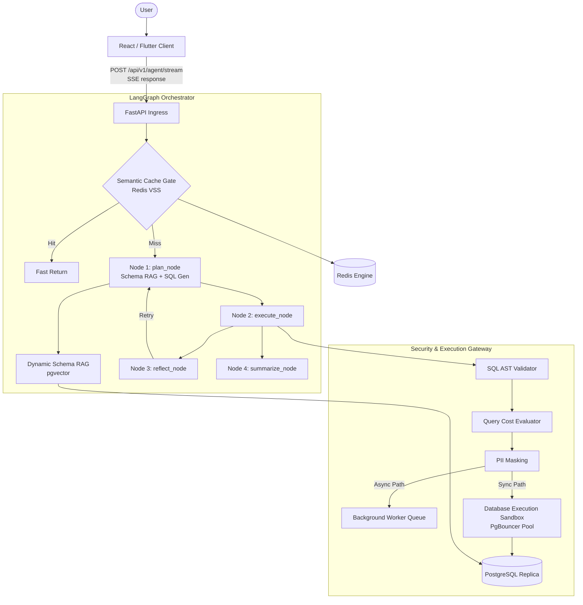

# 🏛️ Architecture Specification: Enterprise Agentic Text-to-SQL Platform

**System Overview:** An enterprise-grade, multi-tenant Text-to-SQL platform that translates natural language prompts into dialect-specific SQL, validates execution safety via AST parsing and EXPLAIN cost gates, executes queries against isolated read-only replicas, and streams live progress, dataset tables, and declarative visualization specs to the frontend via Server-Sent Events (SSE).

## 1. High-Level System Architecture



## 2. Shared Execution State (AgentState)

The state dictionary is the core data contract passed between LangGraph nodes during execution.

```python
from typing import TypedDict, List, Dict, Any, Annotated
from langgraph.graph.message import add_messages

class AgentState(TypedDict):
    # Ingress Parameters
    prompt: str                         # Natural language question from user
    tenant_id: str                      # Current active tenant UUID
    user_id: str                        # Authenticated user ID

    # Planning & Schema RAG Phase
    plan_strategy: str                  # High-level join strategy derived from RAG
    retrieved_schemas: List[Dict[str, Any]] # Schema DDLs retrieved from pgvector
    sql_query: str                      # Candidate SQL generated by LLM

    # Execution & Validation Phase
    raw_results: List[Dict[str, Any]]   # Query execution result set from PostgreSQL
    explain_cost: float                 # Estimated total cost from EXPLAIN engine
    ast_valid: bool                     # AST compliance flag from sqlglot

    # Visualization & Formatting Phase
    summary: str                        # Synthesized text answer
    chart_spec: Dict[str, Any]          # Declarative Chart.js / Vega configuration

    # Reflection & Resilience
    error_message: str                  # DB or AST exception error trace
    retry_count: int                    # Self-correction loop counter (Max: 3)
    current_phase: str                  # Execution milestone tracking
```

## 3. LangGraph Node Lifecycle & Data Flow

### Node 1: `plan_node` (Schema RAG + SQL Generation)
- **Inputs**: `state["prompt"]`, `state["tenant_id"]`, `state["retry_count"]`
- **Actions**:
  - Queries `schema_embeddings` via pgvector hybrid search (Dense Cosine + Sparse BM25) filtered by `tenant_id`.
  - Traverses foreign keys to attach connected lookup schemas.
  - Formulates a single structured prompt to the LLM (Temperature: 0.0).
  - If `retry_count > 0`, injects `state["error_message"]` into context to trigger self-correction.
- **Outputs**: `plan_strategy`, `sql_query`, `current_phase="planning_complete"`

### Node 2: `execute_node` (AST Validation + EXPLAIN Gate + DB Execution)
- **Inputs**: `state["sql_query"]`, `state["tenant_id"]`
- **Actions**:
  - **AST Check (sqlglot)**: Validates root statement is `exp.Select`. Rejects multi-statement commands, DML (DROP, DELETE, UPDATE), and administrative functions (COPY TO, dblink).
  - **Cost Gate**: Runs `EXPLAIN (FORMAT JSON)` on a read-only replica. Rejects queries with Total Cost > 10,000 or full table scans on large tables.
  - **DB Execution**: Executes query via asyncpg within tenant session context (`SET LOCAL app.current_tenant_id = '...'`).
  - **PII Masking**: Redacts fields flagged `is_pii = true` in catalog metadata.
- **Outputs**: `raw_results`, `explain_cost`, `current_phase="execution_complete"` (OR `error_message`, `retry_count += 1` on failure).

### Node 3: `summarize_node` (Data Synthesis & Chart Spec Generation)
- **Inputs**: `state["raw_results"]`, `state["prompt"]`
- **Actions**:
  - Formulates a concise textual synthesis of the result set.
  - Constructs declarative, front-end-ready JSON specs for Chart.js / Vega-Lite.
- **Outputs**: `summary`, `chart_spec`, `current_phase="summarize_complete"`

## 4. Real-Time Streaming Protocol (SSE)

The application communicates with the client via a single, long-lived HTTP/2 Server-Sent Events stream (`GET /api/v1/agent/stream`).

**Event Wire Specifications**:

| Event Name | Trigger Phase | Payload Structure | Frontend Action |
| --- | --- | --- | --- |
| `status` | Phase Transitions | `{"phase": "planning", "message": "Retrieving schema..."}` | Updates live spinner / thought animation |
| `plan_ready` | Post `plan_node` | `{"strategy": "...", "sql": "SELECT..."}` | Renders code syntax block & strategy badge |
| `reflection_retry` | Exception in `execute_node` | `{"error": "Column X missing", "retry": 1}` | Displays self-correction indicator |
| `execution_complete` | Post `execute_node` | `{"rows": 5, "data": [...]}` | Renders paginated interactive data grid |
| `final_response` | Post `summarize_node` | `{"summary": "...", "chart_spec": {...}}` | Renders text summary & Chart.js component |

## 5. Security & Isolation Matrix

| Layer | Security Mechanism | Enforcement Point |
| --- | --- | --- |
| **Multi-Tenancy** | PostgreSQL Row-Level Security (RLS) | Database session scope (`app.current_tenant_id`) |
| **Query Parsing** | AST Static Analysis (`sqlglot`) | `execute_node` prior to database driver execution |
| **Resource Protection** | EXPLAIN (FORMAT JSON) Cost Evaluation | Cost limits (> 10,000 units rejected or offloaded) |
| **DB Role Limits** | Low-privilege `agent_read_only_runner` | `statement_timeout = 10s`, `work_mem = 64MB` |
| **Data Privacy** | Schema-Driven Column Redaction | Post-execution filter matching `is_pii` catalog flags |
| **Proxy Buffering** | Unbuffered Headers (`X-Accel-Buffering: no`) | API Gateway & FastAPI StreamingResponse |

## 6. Development & Coding Conventions

- **Async-First**: Every database query, network call, and LLM invocation MUST use async/await. Synchronous blocking calls are forbidden in the application thread.
- **Deterministic State Graphs**: No loose agent loops. Graph transitions MUST execute through defined, type-checked LangGraph state nodes.
- **Pydantic v2 Standardization**: All data transfer objects (DTOs), API parameters, and environment settings MUST use Pydantic v2 validation models.
- **Resilient SSE Connection**: The API must explicitly handle client disconnects during `graph.astream()` to avoid orphan database connections or wasted API tokens.

## 7. File Structure

```text
ai-database-agent/
├── .github/
│   └── workflows/
│       ├── ci-cd.yml                # Lint, Type Check, Security Scan, Golden Dataset Eval
│       └── schema-sync.yml          # Re-indexes pgvector catalog on DB migration
├── docker/
│   ├── Dockerfile.api               # Production FastAPI container
│   ├── Dockerfile.worker            # Celery / BullMQ async queue worker
│   └── pgbouncer/
│       └── pgbouncer.ini            # PgBouncer connection pooling configs
├── docker-compose.yml               # Homelab / Local Dev (API, Postgres+pgvector, Redis, PgBouncer)
├── pyproject.toml                   # Dependencies, Ruff, Mypy, Pytest configurations
├── README.md
│
└── src/
    ├── app/
    │   ├── __init__.py
    │   ├── main.py                  # FastAPI app initialization, middleware, lifecycle
    │   ├── config.py                # Pydantic BaseSettings (Env variables & validation)
    │   │
    │   ├── api/                     # Ingress HTTP Layer
    │   │   ├── __init__.py
    │   │   ├── router.py            # Main API v1 router aggregator
    │   │   ├── dependencies.py      # Auth JWT claims, Tenant Context, DB Session injectors
    │   │   └── v1/
    │   │       ├── chat.py          # GET /api/v1/agent/stream (SSE Endpoint)
    │   │       ├── sessions.py      # CRUD for chat sessions
    │   │       └── health.py        # Liveness & Readiness probes
    │   │
    │   ├── agent/                   # LangGraph Orchestration Core
    │   │   ├── __init__.py
    │   │   ├── state.py             # AgentState TypedDict definition
    │   │   ├── graph.py             # StateGraph builder, conditional edges, compilation
    │   │   ├── nodes/               # Graph Execution Nodes
    │   │   │   ├── __init__.py
    │   │   │   ├── plan_node.py     # Schema RAG + SQL generation
    │   │   │   ├── execute_node.py  # AST verification + DB Replica execution
    │   │   │   ├── summarize_node.py# Summary text + Chart.js JSON formulation
    │   │   │   └── reflect_node.py  # Self-correction prompt handling on execution failure
    │   │   └── prompts/             # System Prompts & Jinja2 Templates
    │   │       ├── sql_generator.prompt
    │   │       └── chart_builder.prompt
    │   │
    │   ├── core/                    # Security, AST & Execution Gates
    │   │   ├── __init__.py
    │   │   ├── ast_validator.py     # sqlglot parser rules (SELECT enforcement, DML blocking)
    │   │   ├── cost_evaluator.py    # EXPLAIN (FORMAT JSON) parser & threshold gate
    │   │   ├── pii_redactor.py      # Column-level schema masking engine
    │   │   └── sse_formatter.py     # Helper to format Python dicts into SSE text streams
    │   │
    │   ├── services/                # RAG, Caching & External Integration
    │   │   ├── __init__.py
    │   │   ├── schema_rag.py        # Vector Schema Catalog retriever (pgvector + BM25)
    │   │   ├── semantic_cache.py    # Redis VSS Cosine Similarity Cache engine
    │   │   └── session_memory.py    # Hot Redis context buffer + Cold Postgres log sync
    │   │
    │   ├── db/                      # Database Layer & Connection Drivers
    │   │   ├── __init__.py
    │   │   ├── postgres.py          # asyncpg connection pools & Tenant Session setters
    │   │   ├── redis.py             # Redis async client setup
    │   │   ├── models/              # SQLAlchemy / Prisma Schemas
    │   │   │   ├── tenant.py
    │   │   │   ├── chat_message.py
    │   │   │   └── schema_catalog.py
    │   │   └── migrations/          # Alembic / Database Migration scripts
    │   │
    │   └── utils/                   # Shared Helpers
    │       ├── logger.py            # Structured JSON Logger
    │       └── tracing.py           # OpenTelemetry & LangSmith instrumentation
    │
    └── tests/                       # Testing Suite
        ├── unit/                    # AST parser & PII masking unit tests
        ├── integration/             # LangGraph state transitions & FastAPI SSE stream tests
        └── benchmark/               # Golden Dataset evaluation suite (RAGAS / DeepEval)
```